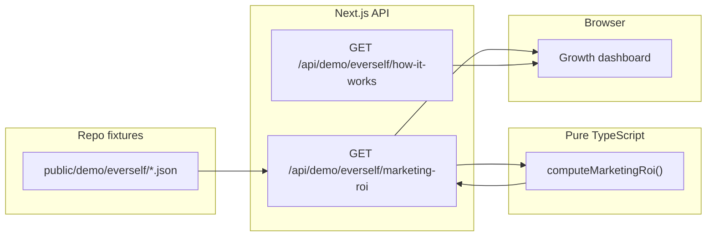

# Everself Growth Command Center — How the logic works

This document explains the **demo** implementation on `/consumer/reports`: where data lives, how it flows through the app, and how metrics are computed.

## Architecture overview

1. **Static JSON** under `public/demo/everself/` holds spend, leads, appointments, creative metadata, and numeric targets.
2. **`GET /api/demo/everself/marketing-roi`** reads those files on the server (with short in-memory caching), runs **`computeMarketingRoi()`** in `src/lib/everself/compute-rollups.ts`, and returns one JSON payload for the UI.
3. The **reports page** is a client component that builds filter state from the URL query string, fetches the ROI endpoint when the URL changes, and renders KPIs, tables, and charts.

There is **no live connection** to ad platforms; everything is deterministic from the fixtures.

---

## Request flow and URL state

- Filter state is reflected in the **query string** (`start`, `end`, `cities`, `channels`, `bookingGroup`, `campaign`).
- Changing filters in the UI only updates local state until the user clicks **Apply**, which writes the query string via `router.replace`.
- When `searchParams` change, the dashboard **refetches** the marketing-roi API using the new parameters. That keeps shareable URLs and avoids refetching on every keystroke before Apply.

---

## API: `GET /api/demo/everself/marketing-roi`

### Query parameters

| Parameter       | Meaning |
|----------------|---------|
| `start`, `end` | Inclusive ISO dates `YYYY-MM-DD` for the reporting window. |
| `cities`       | Comma-separated city names. **Omit or empty** = all cities. |
| `channels`     | Comma-separated `google` and/or `meta`. **Empty** = both. |
| `bookingGroup` | `booked` (default) or `lead` — see [Booking cohort](#booking-cohort-booked-date-vs-lead-date). |
| `campaign`     | Substring match on lead `campaign_id` / `utm_campaign` and spend `campaign_id` / `campaign_name`. |

### Caching (server)

- Raw JSON files are read at most once per **~60 seconds** (in-memory bundle).
- The computed response is memoized per full query string for **~30 seconds**.

### Response shape (high level)

- **`meta`**: `generated_at`, `source: "json-demo"`.
- **`config`**: `targets` for city “scale” badges (cost per booked, min lead→book rate, min booked volume).
- **`available_cities`**: Distinct cities from **leads in the date range**, after channel + campaign filters, **before** applying the city filter (so the city dropdown stays useful when a subset is selected).
- **`kpis`**: Period totals + cost metrics + **deltas vs the previous period of the same length** immediately before `start`.
- **`daily`**: Rows of `date × city × channel` with spend, funnel counts, costs, lag, and per-cell attribution stats.
- **`by_city` / `by_channel`**: Aggregates over the period for the table and funnel splits.
- **`diagnostics`**: Period-level CPC, CTR, lead rate, book rate, click-ID coverage, and “missing field” rates.
- **`creative`**: Rollups keyed by `utm_content`, enriched from `creative_assets.json` when `utm_content` matches.
- **`trend`**: One row per calendar day in `[start, end]` for chart series (spend and booked by channel, CP booked).

---

## Data contracts (fixtures)

### `spend_daily.json`

One row per day / city / channel / campaign scope. Required: `date`, `city`, `channel`, `spend`. Optional: impressions, clicks, campaign ids/names.

Rows are **deduped** by a composite key, then **summed** into `date × city × channel` for the daily grid.

### `leads.json`

One row per lead. Required: `lead_id`, `created_at`, `city`, `channel`. `date` defaults to `created_at.slice(0, 10)` if omitted.

Used for: lead counts by day/city/channel, attribution coverage, campaign filter, and joining appointments to marketing dimensions.

### `appointments.json`

Links to `lead_id`. Required: `appointment_id`, `lead_id`, `city`, `booked_at`, `status`.

- **Booked consults** include statuses `booked` and `completed`.
- **Completed consults** use `status === "completed"` and attribute completion to **`completed_at`** when present; otherwise the booked date is used as a fallback.

City and channel for funnel math come from the **lead** when present (appointments inherit marketing context from the lead).

### `config.json`

Defines **`targets`** used for city table “scale” badges (green / yellow / red), e.g. target cost per booked and minimum lead→book rate.

### `creative_assets.json`

Optional metadata keyed by `utm_content` for the creative performance table (hook, format, headline).

---

## Core model: `date × city × channel`

The backbone is a set of **daily keys** `(date, city, channel)` where `channel` is `google` or `meta`.

For each key we combine:

1. **Spend** — summed from rolled-up spend rows in range.
2. **Leads** — distinct `lead_id` whose **lead date** (`date` or `created_at` day) equals `date` and matches filters.
3. **Booked consults** — distinct `appointment_id` with qualifying status; the **grouping date** depends on booking mode (below).
4. **Completed consults** — distinct completed appointments; completion is attributed to **completion date** (with fallback).

Derived metrics per row:

- **CPL** = spend ÷ leads  
- **CP booked** = spend ÷ booked consults  
- **CP completed** = spend ÷ completed consults  
- **Lead→book rate** = booked ÷ leads  
- **Book→complete rate** = completed ÷ booked  
- **Median / P75 lead→book lag** — from lag samples in that cell (booked-date grouping for lag; see below).

Safe division returns `null` when the denominator is zero.

---

## Booking cohort: “Booked date” vs “Lead date”

This toggle only changes **which calendar day** receives credit for **booked** and **completed** counts when building the `daily` grid:

| Mode   | Booked consults counted on… | Completed consults counted on… |
|--------|------------------------------|-----------------------------------|
| `booked` | `booked_at` date (UTC day) | `completed_at` date (or fallback) |
| `lead`   | Lead’s `created_at` date (cohort) | Same cohort day as lead |

Spend and **lead** counts always use the lead’s creation day and spend row dates respectively.

**Lag metrics** (lead → book in days) are always computed from real timestamps (`created_at` → `booked_at`), grouped by **booked date** + lead city/channel for the per-cell median/P75, and a **global period median** for the KPI tile uses booked dates inside `[start, end]` with city/channel filters applied.

---

## Prior-period deltas (KPI tiles)

For the selected `[start, end]` window, the previous window is **`[start − N, end − N]`** where `N` is the inclusive number of days in the range.

Headline metrics and costs are compared **period over period**; percentage change is shown when the previous value exists and is non-zero where required.

---

## City allocation table

- Cities are aggregated over the full period (all channels combined in each city row).
- **Default sort**: ascending **cost per booked** (best first), with rows that have **no spend** sorted after spenders.
- **Scale signal** uses `config.targets`: green when booked volume and efficiency thresholds are met; red when CP booked is too high vs target or lead→book rate is below minimum; yellow otherwise.

**Export CSV** serializes the same `by_city` rows the table uses.

---

## Trends panel

Built from the **`trend`** array: per-day spend and booked splits by channel, and derived CP booked. The diagnostic strip shows **CPC, CTR, lead rate, book rate** when the underlying numerators/denominators exist (e.g. if impressions are zero, CTR is omitted from the logic as unavailable).

---

## Attribution panel

Per the spec’s demo rules:

- **Click ID coverage** is evaluated per channel (Google: `gclid` / `wbraid` / `gbraid`; Meta: `fbclid` / `fbp` / `fbc`).
- A lead counts as **attributed** if it has a relevant click ID **or** both `utm_source` and `utm_campaign`.
- **Unattributed** counts are leads that fail that combined rule.

Field-level cards show **missing city, channel, or campaign_id** as percentages of leads in the filtered period.

---

## Creative grid

Leads are grouped by **`utm_content`** (or “unknown”). Appointments roll up to the same bucket via the lead’s `utm_content`. `creative_assets.json` merges in hook/format/headline when `utm_content` matches.

---

## File reference

| Area | Location |
|------|----------|
| Types | `src/lib/everself/types.ts` |
| Math helpers | `src/lib/everself/metrics.ts` |
| Rollups | `src/lib/everself/compute-rollups.ts` |
| Client fetch helper | `src/lib/everself/api.ts` |
| ROI API route | `src/app/api/demo/everself/marketing-roi/route.ts` |
| How-it-works API | `src/app/api/demo/everself/how-it-works/route.ts` |
| Dashboard UI | `src/components/everself/*` |
| Page | `src/app/consumer/(consumer)/reports/page.tsx` |
| Demo JSON | `public/demo/everself/` |

---

## Related product spec

The original product and data-contract spec lives in `docs/everself-growth-dashboard-spec.md`. This file focuses on **what we implemented** in code and how it behaves in the demo.
